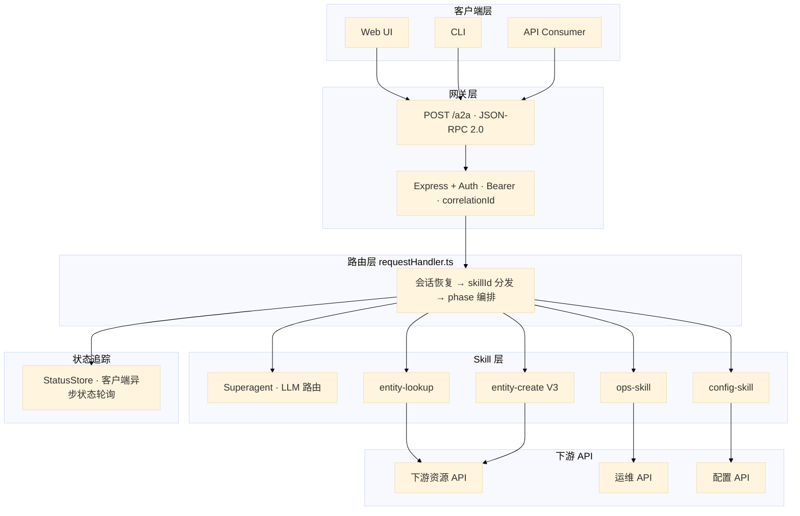
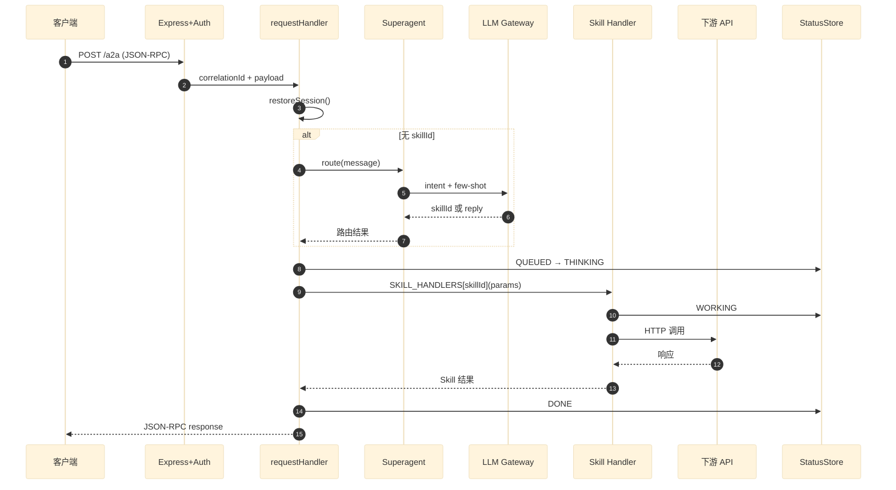

# A2A Agent Design DOC

> **项目**: A2A Agent (Superagent)  
> **版本**: 公开脱敏版  
> **协议**: A2A / JSON-RPC 2.0  
> **说明**: 内部文件名、业务枚举、部署细节已泛化，仅供面试 / 学习参考

---

## 1. 系统架构图（大图版）

> 下图按层展开，每层单独一张，方便直接截图 / 复制到 PPT，无需缩放。

---

### 1.1 总览：一张图看懂全流程

```
┏━━━━━━━━━━━━━━━━━━━━━━━━━━━━━━━━━━━━━━━━━━━━━━━━━━━━━━━━━━━━━━━━━━━━━━━━━━━━━━┓
┃                              客 户 端 层                                      ┃
┃                    Web UI          CLI          API Consumer                ┃
┗━━━━━━━━━━━━━━━━━━━━━━━━━━━━━━━━━━━━━━━━━━━━━━━━━━━━━━━━━━━━━━━━━━━━━━━━━━━━━━┛
                                        │
                                        │  POST /a2a
                                        │  JSON-RPC 2.0
                                        ▼
┏━━━━━━━━━━━━━━━━━━━━━━━━━━━━━━━━━━━━━━━━━━━━━━━━━━━━━━━━━━━━━━━━━━━━━━━━━━━━━━┓
┃                         Express 5  +  Auth 层                                 ┃
┃              Bearer Token 验证  │  correlationId 转发  │  响应序列化          ┃
┗━━━━━━━━━━━━━━━━━━━━━━━━━━━━━━━━━━━━━━━━━━━━━━━━━━━━━━━━━━━━━━━━━━━━━━━━━━━━━━┛
                                        │
                                        ▼
┏━━━━━━━━━━━━━━━━━━━━━━━━━━━━━━━━━━━━━━━━━━━━━━━━━━━━━━━━━━━━━━━━━━━━━━━━━━━━━━┓
┃                    requestHandler.ts  —  核心路由 & 会话管理                      ┃
┃                                                                               ┃
┃   ① 从 correlationId 恢复 session（lookupSessionStore / dialogSessionStore）       ┃
┃   ② 若无 skillId  →  调用 Superagent（LLM 意图路由）                          ┃
┃   ③ 按 skillId + session phase  →  分发到对应 Skill Handler                  ┃
┗━━━━━━━━━━━━━━━━━━━━━━━━━━━━━━━━━━━━━━━━━━━━━━━━━━━━━━━━━━━━━━━━━━━━━━━━━━━━━━┛
                                        │
              ┌─────────────────────────┼─────────────────────────┐
              │                         │                         │
              ▼                         ▼                         ▼
┏══════════════════════┓   ┏══════════════════════┓   ┏══════════════════════┓
┃  Superagent          ┃   ┃  entity-lookup      ┃   ┃  entity-create V3      ┃
┃  LLM 智能路由         ┃   ┃  资源查询             ┃   ┃  资源创建             ┃
┃  → 直接 reply         ┃   ┃  + lookupSessionStore    ┃   ┃  + dialogSessionStore ┃
┃  → 或返回 skillId     ┃   ┗══════════════════════┛   ┗══════════════════════┛
┗══════════════════════┛              │                         │
              │                         │                         │
              │              ┌────────┴────────┐                │
              │              ▼                 ▼                ▼
              │     ┏══════════════┓   ┏══════════════┓  ┏══════════════┓
              │     ┃ ops-skill    ┃   ┃ config-skill ┃  ┃ 下游资源 API  ┃
              │     ┃ 节点运维      ┃   ┃ 节点配置      ┃  ┗══════════════┛
              │     ┗══════════════┛   ┗══════════════┛
              │              │                 │
              └──────────────┴─────────────────┘
                                        │
                                        ▼
┏━━━━━━━━━━━━━━━━━━━━━━━━━━━━━━━━━━━━━━━━━━━━━━━━━━━━━━━━━━━━━━━━━━━━━━━━━━━━━━┓
┃                            StatusStore  外部服务                              ┃
┃              QUEUED  →  THINKING  →  WORKING  →  DONE / FAILED              ┃
┃                        客户端异步状态轮询                                      ┃
┗━━━━━━━━━━━━━━━━━━━━━━━━━━━━━━━━━━━━━━━━━━━━━━━━━━━━━━━━━━━━━━━━━━━━━━━━━━━━━━┛
```

---

### 1.2 Skill 调用路径（两种模式）

```
═══════════════════════════════════════════════════════════════════════════════
  模式 A：Superagent 智能路由（客户端只发自然语言，不带 skillId）
═══════════════════════════════════════════════════════════════════════════════

  Client                requestHandler              Superagent           Skill
    │                        │                        │                  │
    │  POST /a2a             │                        │                  │
    │  "give me 2 type-A records"  │                        │                  │
    │───────────────────────>│                        │                  │
    │                        │  无 skillId            │                  │
    │                        │───────────────────────>│                  │
    │                        │                        │  LLM 意图分类     │
    │                        │                        │  + few-shot      │
    │                        │  skillId=              │                  │
    │                        │  "entity-lookup"      │                  │
    │                        │<───────────────────────│                  │
    │                        │                        │                  │
    │                        │  handler["entity-lookup"](params)         │
    │                        │──────────────────────────────────────────>│
    │                        │                        │                  │ 调下游资源 API
    │                        │                        │                  │ 读写 lookupSessionStore
    │                        │  result                │                  │
    │                        │<──────────────────────────────────────────│
    │  JSON-RPC response     │                        │                  │
    │<───────────────────────│                        │                  │


═══════════════════════════════════════════════════════════════════════════════
  模式 B：直接指定 skillId（跳过 LLM 路由，适合已知操作的客户端）
═══════════════════════════════════════════════════════════════════════════════

  Client                requestHandler                              Skill
    │                        │                                    │
    │  POST /a2a             │                                    │
    │  skillId=              │                                    │
    │  "config-skill"        │                                    │
    │───────────────────────>│                                    │
    │                        │  已有 skillId，跳过 Superagent      │
    │                        │  handler["config-skill"](params)   │
    │                        │───────────────────────────────────>│
    │                        │                                    │ 调配置 API
    │                        │  result                            │
    │                        │<───────────────────────────────────│
    │  JSON-RPC response     │                                    │
    │<───────────────────────│                                    │
```

---

### 1.3 Skills 清单（7 个）

| # | skillId | 名称 | 状态 | Handler 文件 | 下游 |
|---|---------|------|------|-------------|------|
| 1 | entity-lookup | Lookup Entity | 核心 | `lookupSkill.ts` | 下游资源 API |
| 2 | entity-create | Create Entity V3 | 核心 | `createSkill.ts` | 下游资源 API |
| 3 | router-skill | Superagent | 核心 | `routerAgent.ts` | LLM Gateway |
| 4 | ops-skill | Ops Skill | 新增 | ops-skill 模块 | 运维 API |
| 5 | config-skill | Config Skill | 新增 | config-skill 模块 | 配置 API |
| 6 | echo | Echo | 测试 | echo handler | — |
| 7 | legacy-lookup | Legacy Lookup | 已禁用 | legacy | — |

**requestHandler 内部分发逻辑（伪代码）：**

```typescript
const SKILL_HANDLERS = {
  "entity-lookup": lookupHandler,
  "entity-create":    createHandler,
  "ops-skill":      opsHandler,
  "config-skill":   configHandler,
  "echo":           echoHandler,
};

async function requestHandler(req) {
  const session = restoreSession(req.correlationId);   // ① 恢复 session
  let skillId = req.skillId ?? session?.skillId;

  if (!skillId) {
    const route = await superagent.route(req.message); // ② LLM 路由
    if (route.action === "reply") return route.reply;
    skillId = route.skillId;
  }

  updateStatusStore(req.correlationId, "WORKING");     // ③ 更新进度
  const result = await SKILL_HANDLERS[skillId](req, session);  // ④ 调 Skill
  updateStatusStore(req.correlationId, "DONE");
  return result;
}
```

---

### 1.4 Mermaid 架构图（可粘贴 mermaid.live 放大导出）



---

### 1.5 请求时序（含 Skill 调用）



---

## 2. 核心组件说明

| 组件 | 职责 | 关键文件 |
|------|------|----------|
| **requestHandler** | 会话恢复、skillId 分发、多轮 phase 编排 | `requestHandler.ts` |
| **Superagent** | LLM-only 智能路由，outOfScope 分类，intent 转换 | `routerAgent.ts` |
| **entity-lookup** | 资源查询 + 工作流状态机 + 多轮补参 | `lookupSkill.ts` |
| **entity-create V3** | 多轮确认创建 + 全局校验 + 工单 + 状态监控 | `createSkill.ts` |
| **ops-skill** | 容量 / 配额运维 | ops-skill 模块 |
| **config-skill** | 节点配置只读查询 | config-skill 模块 |
| **lookupSessionStore** | entity-lookup 多轮会话（1h TTL） | `lookupSessionStore.ts` |
| **dialogSessionStore** | entity-create 确认流程（1h TTL） | `dialogSessionStore.ts` |
| **StatusStore** | 异步进度追踪（客户端异步状态轮询） | 外部服务 |
| **LLM Gateway** | 参数提取 + 意图判断 | small-llm-model |

---

## 3. Session & Cache 设计

### 3.1 三层存储选型（当前 → 目标）

```
┌─────────────────────────────────────────────────────────────────────────────┐
│  Layer 1 · In-Memory Cache（进程内 Map）          ← 当前 当前版本            │
│  lookupSessionStore / dialogSessionStore / 类型 Cache / 元数据 Cache         │
│  优点：零网络延迟  │  缺点：Pod 重启丢数据、多 Pod 不共享、内存持续增长       │
└─────────────────────────────────────────────────────────────────────────────┘
                                    │  P0 迁移
                                    ▼
┌─────────────────────────────────────────────────────────────────────────────┐
│  Layer 2 · Redis（共享 Session Store）            ← Roadmap P0              │
│  Session / 多轮对话 / Rate Limit / 分布式锁 / 短期对话历史                    │
│  优点：跨 Pod 共享、TTL 自动过期、<1ms 延迟、支持横向扩容                      │
└─────────────────────────────────────────────────────────────────────────────┘
                                    │  低优先级
                                    ▼
┌─────────────────────────────────────────────────────────────────────────────┐
│  Layer 3 · SQL（MySQL / Postgres）                ← 未来 metrics / 审计       │
│  长期数据持久化：工单记录、用户审计、Prompt 日志、指标分析、数据恢复           │
│  优点：ACID、复杂查询  │  缺点：延迟高，不适合高频 Session 读写               │
└─────────────────────────────────────────────────────────────────────────────┘
```

### 3.2 当前 Store 一览

| Store | 用途 | TTL | 文件 | 目标层 |
|-------|------|-----|------|--------|
| lookupSessionStore | entity-lookup 多轮 + 工作流 | 1h | `lookupSessionStore.ts` | → Redis |
| dialogSessionStore | entity-create 多轮确认 | 1h | `dialogSessionStore.ts` | → Redis |
| 下游资源 API Cache | API 响应缓存 | 0（可配） | `lookupSkill.ts` | 可留 In-Memory 或 Redis |
| 类型列表 Cache | categoryType 列表 | 2h | `categoryCacheService.ts` | → Redis（多 Pod 共享） |
| 枚举列表 Cache | 自有/第三方类型 | 24h | `typeResolver.ts` | → Redis |
| 元数据 Cache | 类型元数据 | 24h | `metadataCache.ts` | → Redis |

### 3.3 In-Memory → Redis 迁移动机（架构图）

```
【当前问题】Load Balancer 后面多 Pod，Session 存在各自内存里

  User ──→ Load Balancer ──→ Agent Pod A   (Session 在 A 的内存)
                    │
                    └──→ Agent Pod B   (B 不知道 A 存了什么 → 多轮对话断裂)

  同时：Session 越来越多 → Agent 内存膨胀 → OOM / GC 变慢 / Crash


【Redis 方案】所有 Pod 共享同一个 Session Store

  User ──→ Load Balancer ──→ Agent Pod A ──┐
                    │                       ├──→ Redis (Session Store)
                    └──→ Agent Pod B ──────┘
                              │
                    Agent1 … Agent10 全部读写同一个 Redis
                    → 无状态 Agent，可随意横向扩容
```

---

## 4. Superagent 路由逻辑

```
用户输入 → small-llm-model (temperature=0.1, 100+ few-shot)
    ├─ 问候 / 感谢           → action: "reply"
    ├─ 超出范围              → action: "reply" + outOfScopeType
    ├─ 查资源                → skillId: "entity-lookup"
    ├─ 创建资源              → skillId: "entity-create"
    ├─ 节点运维              → skillId: "ops-skill"
    └─ 节点配置              → skillId: "config-skill"
```

---

## 5. 技术栈 & 部署

| 层 | 技术 |
|----|------|
| Runtime | Node.js 20.17.0 |
| 语言 | TypeScript 4.9 |
| 框架 | Express 5 |
| LLM | 企业 LLM 网关 (small-llm-model) |
| 协议 | A2A / JSON-RPC 2.0 |
| 部署 | Kubernetes · namespace `app-prod` |

---

## 6. 架构五要素

1. **Superagent** — 智能入口（LLM 意图分类）
2. **Skills** — 专业执行器（7 个独立技能）
3. **Session Store** — 上下文管理（多轮对话）
4. **StatusStore** — 进度追踪（客户端异步状态轮询）
5. **Cache** — 性能优化（避免重复 API 调用）

---

## 7. System Design 八股（面试 Q&A）

### Q1: 为什么用 JSON-RPC 2.0 而不是 REST？

**答**: Agent 通信是 action-oriented，单一 endpoint `POST /a2a`，结构化 error code，适合 skill 调用模式。

---

### Q2: Superagent 用 LLM 做路由，延迟和成本怎么控？

**答**: 小模型 small-llm、temperature=0.1、**100+ few-shot** 提高准确率；问候/感谢直接 reply 不调下游 Skill；结构化字段（categoryType 等）用 **Regex** 而非 LLM，避免多余 token。详见 **Q14**。

---

### Q3: In-Memory Session 有什么问题？如何改进？

**答**: 三个核心问题：

1. **Pod 重启丢 Session** — lookupSessionStore / dialogSessionStore 全在进程内存，滚动发布即中断多轮对话  
2. **Load Balancer 路由不一致** — 第 1 轮打到 Pod A，第 2 轮打到 Pod B，B 读不到 A 的 Session  
3. **内存持续增长** — Session 堆积 → OOM / GC 变慢 / Agent Crash（高流量 caller 不敢全量开放）

**改进：** 迁移到 Redis，key = `session:{correlationId}`，TTL = 1h，Agent 变无状态。详见 **Q13**。

---

### Q4: 多级 Cache TTL 怎么设计？

**答**: 下游资源 API（可配/默认 0）、类型列表（2h）、枚举列表（24h）、元数据（24h）、Session（1h）。

---

### Q5: StatusStore 状态机？

**答**: `QUEUED → THINKING → WORKING → DONE/FAILED`，外部服务，客户端异步状态轮询。

---

### Q6: Auth 和安全？

**答**: Bearer Token + 密钥管理服务注入密钥，correlationId 仅用于追踪。

---

### Q7: 多轮对话怎么实现？

**答**: correlationId 串联；lookupSessionStore 存工作流状态；dialogSessionStore 存 entity-create phase。

---

### Q8: K8s 部署注意什么？

**答**: 2 CPU/1-2Gi、GET /health probe、Graceful Shutdown、namespace `app-prod`。

---

### Q9: LLM Fallback？

**答**: 主 LLM 超时/5xx → 重试 → fallback 模型或返回友好错误 + correlationId。

---

### Q10: 如何评估 Agent 质量？

**答**: 路由准确率、P99 延迟、Skill DONE/FAILED 比、Session 续接率、Cache 命中率。

---

### Q11: Skill 是怎么被调用的？（无 MCP）

**答**:

**本系统没有 MCP。** Skill 是 Agent 进程内的 TypeScript 模块，通过 `requestHandler` 按 `skillId` 分发，不是 MCP Tool。

**调用链路：**

```
Client
  → POST /a2a (JSON-RPC 2.0)
  → Express + Auth（Bearer Token, correlationId）
  → requestHandler.ts
       ① restoreSession(correlationId)
       ② 无 skillId → Superagent → LLM → 返回 skillId 或 reply
       ③ SKILL_HANDLERS[skillId](params, session)
  → Skill Handler（TS 模块）
  → 下游 HTTP API
  → JSON-RPC response
```

**两种模式：**

| 模式 | 触发条件 | 是否经过 LLM |
|------|----------|-------------|
| A. 智能路由 | 客户端只发自然语言 | ✅ Superagent 选 skillId |
| B. 直接调用 | 客户端请求里带 skillId | ❌ 跳过 Superagent |

**分发机制：** `requestHandler` 维护 `skillId → handler function` 映射表，类似 switch/map，**不是** MCP 的 `tools/call`。

**Skill 与代码对应：**

| skillId | Handler |
|---------|---------|
| entity-lookup | `lookupSkill.ts` |
| entity-create | `createSkill.ts` |
| ops-skill | ops-skill 模块 |
| config-skill | config-skill 模块 |
| echo | echo handler |

---

### Q12: 这套架构和 MCP 有什么区别？

**答**:

| 维度 | 本 A2A Agent | MCP (Model Context Protocol) |
|------|-------------|------------------------------|
| **协议** | JSON-RPC 2.0，`POST /a2a` | MCP over stdio / SSE / HTTP |
| **Skill/Tool 位置** | Agent **进程内** TS 模块 | **独立** MCP Server |
| **工具发现** | 代码写死 7 个 Skill | 运行时 `tools/list` 动态发现 |
| **谁决定调哪个** | Superagent (LLM) 或客户端指定 skillId | Host LLM 选 MCP Tool |
| **部署模型** | 单一 Agent 服务 | Host + 多个 MCP Server 插件 |
| **适用场景** | 固定业务 Skill、企业内部 Agent | IDE/通用 Agent 接外部工具（DB、Git、API） |
| **扩展方式** | 加新 Skill 模块 + 注册到 handler map | 加新 MCP Server，无需改 Agent 代码 |
| **本项目的选型** | ✅ 当前采用 | ❌ 未使用 |

**为什么不用 MCP？**

1. Skill 固定（7 个），不需要运行时动态发现  
2. 全部在同一 Node 进程，In-Memory Session 直接共享  
3. JSON-RPC 2.0 对内部 A2A 客户端（Web UI / CLI）足够  
4. 延迟更低——无跨进程 MCP 通信开销  

**什么时候该考虑 MCP？**

- 要把 Skill 拆成独立团队维护的服务  
- 需要 IDE（如 Cursor）或通用 Agent 即插即用接入  
- Skill 数量动态增长，需要 `tools/list` 自动发现  

**演进路径（可选）：** 未来可将 ops-skill / config-skill 拆为独立 MCP Server，Agent 从进程内 handler 改为 MCP Client 调用——但 当前版本 尚未采用。

---

### Q13: Redis 怎么 Scale？什么时候用 Redis / SQL / In-Memory Cache？

**答**:

#### 一、三层存储决策表（面试直接背这张）

| 数据类型 | 读写特征 | 生命周期 | 选型 | 本项目例子 |
|----------|----------|----------|------|-----------|
| 多轮 Session 状态 | 高频读 + 高频写 | 分钟~小时，可丢 | **Redis** | lookupSessionStore、dialogSessionStore |
| 短期对话上下文 | 高频读 + 写 | 30min~1h | **Redis** | entity-lookup 工作流 phase |
| API 响应缓存 | 读多写少 | 分钟~小时 | In-Memory **或** Redis | 下游资源 API Cache |
| 静态元数据缓存 | 读极多写极少 | 小时~天 | In-Memory（单 Pod）→ **Redis（多 Pod）** | 枚举列表、元数据、类型 Cache |
| 进度追踪 | 中频写 | 单次请求 | 外部服务 / Redis | StatusStore |
| 限流 / 分布式锁 | 高频原子操作 | 秒~分钟 | **Redis** | 未来 Rate Limit |
| 工单 / 审计 / 指标 | 低频写、需查询 | 永久 | **SQL** | 工单系统 记录、Prompt 日志 |
| 用户 / 订单 / 日志 | 低频写、需 JOIN | 永久 | **SQL** | 长期数据恢复、metrics 分析 |

**一句话口诀：**

> **Session 走 Redis，永久走 SQL，单机热点走 In-Memory。**

---

#### 二、为什么 Session 不能放 SQL？

| | Redis | MySQL / Postgres |
|--|-------|-----------------|
| 存储 | 内存 | 磁盘 (+ buffer pool) |
| 典型延迟 | **< 1ms** | 5~50ms |
| QPS | 10万~100万+ | 数千~数万 |
| TTL 过期 | **原生支持** `EXPIRE` | 需定时任务清理 |
| 多轮对话每轮读写 | ✅ 适合 | ❌ 延迟高、DB 压力大 |

聊天机器人典型路径：

```
收到消息 → Redis 取 Session (<1ms) → LLM 推理 (秒级) → Redis 更新 Session (<1ms)
```

Redis 耗时相对 LLM 推理**几乎可忽略**；放 SQL 则每轮多 10~50ms 且放大 DB 连接压力。

---

#### 三、为什么现在还留 In-Memory Cache？

**当前版本 现状合理：** 低流量、单 namespace、快速迭代。

| 适合 In-Memory 的场景 | 不适合 In-Memory 的场景 |
|----------------------|------------------------|
| 开发 / 测试环境 | 生产多 Pod + Load Balancer |
| 单 Pod 部署 | 多 caller 高并发 |
| 丢了可重建的静态元数据（枚举列表） | 多轮 Session（entity-lookup / entity-create） |
| 进程内只读、无跨 Pod 需求 | 需要 TTL 自动清理大量 Session |

**当前风险（已在 Roadmap P0）：** 只对部分低流量 caller 开放 Session；全量开放后 In-Memory Session 会导致内存暴涨、Agent Crash。

---

#### 四、Redis 怎么 Scale？

**1. 基本架构：共享 Session Store**

```
Agent Pod 1 ──┐
Agent Pod 2 ──├──→ Redis Primary（Session + Cache）
Agent Pod N ──┘         │
                        └──→ Read Replica（可选，读多写少时）
```

- Agent 变**无状态**：只处理请求，Session 全部外置到 Redis  
- K8s HPA 随意加 Pod，无需 Sticky Session  
- Key 设计：`session:{correlationId}`，`lookup:{correlationId}`，`conv:{correlationId}`

**2. TTL 自动过期（不用自己写清理代码）**

```
SET session:abc123  { skillId, phase, params... }  EX 3600
→ 1h 无活动自动删除，内存不会无限增长
```

**3. 横向扩容 Redis 本身**

| 阶段 | 方案 | 适用 |
|------|------|------|
| 初期 | 单节点 Redis + 持久化 (AOF) | Session 量 < 几 GB |
| 中期 | Redis Sentinel（主从 + 自动 failover） | 需要高可用 |
| 大规模 | Redis Cluster（16384 slots 分片） | Session 量超单节点内存 |
| 读多写少 | Primary + Read Replicas | 枚举列表 / 元数据缓存 |

**4. 分片策略**

```
slot = hash(correlationId) % num_shards
→ 同一用户的多轮对话始终落在同一 shard，保证 Session 一致性
```

**5. Redis 后续还能承载的能力（行业通用）**

LangGraph、OpenAI Agents、Semantic Kernel 等 Agent 框架均推荐 Redis 用于：

| 能力 | 用途 |
|------|------|
| Session Store | 多轮对话状态（当前 P0） |
| Conversation History | 短期对话历史 |
| Rate Limit | 按 caller / user 限流 |
| Distributed Lock | 防止同一 Session 并发写冲突 |
| Queue | 异步 Skill 任务排队 |
| Cache | 跨 Pod 共享 API 响应缓存 |

---

#### 五、SQL 在本项目的定位（低优先级）

> DB 主要用于**长期数据恢复**和**指标分析**，不是 Agent 实时路径上的组件。

| 放 SQL 的 | 不放 SQL 的 |
|-----------|------------|
| 工单创建记录（审计） | 当前 Session phase |
| Prompt / Response 日志（metrics） | lookupSessionStore 工作流状态 |
| 用户操作审计 | 枚举列表热缓存 |
| 历史对话归档（>24h） | StatusStore 实时进度 |

**行业惯例：** Redis 存当前 Session，MySQL/Postgres 存订单、用户、日志等长期数据——两层分工，互不替代。

---

#### 六、迁移路径（面试可画）

```
Phase 0 (现在)     In-Memory Map，单 Pod 可用，多 Pod 有风险
       │
       ▼
Phase 1 (P0)       Session → Redis；Agent 无状态化；开放全量 caller
       │
       ▼
Phase 2 (P1)       静态 Cache (类型列表 / 元数据) → Redis，多 Pod 共享命中率
       │
       ▼
Phase 3 (P2)       Rate Limit + Distributed Lock on Redis
       │
       ▼
Phase 4 (低优先)   Prompt/审计日志 → SQL；用于 metrics & 数据恢复
```

**代码改动最小化：** 抽象 `SessionStore` interface，`InMemorySessionStore` → `RedisSessionStore`，lookupSessionStore / dialogSessionStore 调用方无感知。

---

### Q14: Few-shot 和正则在本项目怎么用？为什么两者结合？

**答**:

本项目的核心策略：**LLM + Few-shot 做智能理解，Regex 做确定性匹配和 Fallback**——各取所长，Regex 不替代 LLM，LLM 不稳定时 Regex 兜底。

```
用户自然语言
    │
    ├──→ Superagent：Few-shot + LLM  →  意图路由 / skillId 选择
    │
    └──→ 确定性层：Regex  →  categoryType 规范化 / JSON 提取 / 动词转换 Fallback
```

---

#### 一、Few-shot：Superagent 智能路由

**位置：** `routerAgent.ts`  
**作用：** 在 System Prompt 里嵌入 **100+ 示例**，教 LLM 如何把自然语言映射到 `skillId` 或 `reply`。

**典型 Few-shot 示例（Prompt 内）：**

| 用户输入 | 期望输出 |
|----------|----------|
| `"hi"` | `{ "action": "reply", "message": "Hello!" }` |
| `"give me 2 type-A records for node 10001"` | `{ "action": "route", "skillId": "entity-lookup" }` |
| `"create 3 type-B records"` | `{ "action": "route", "skillId": "entity-create" }` |
| `"show node config for 1234"` | `{ "action": "route", "skillId": "config-skill" }` |
| `"what's the weather"` | `{ "action": "reply", "outOfScopeType": "trivial" }` |

**为什么用 Few-shot 而不是 fine-tune？**

| | Few-shot | Fine-tune |
|--|----------|-----------|
| 迭代速度 | 改 Prompt 即生效 | 需重新训练 |
| 成本 | 每次推理多 token | 一次性训练成本 |
| 可控性 | 示例即文档，可审计 | 黑盒 |
| 适用 | Skill 固定、示例可枚举 | 海量领域数据 |

**参数：** `small-llm-model`，`temperature=0.1`（低随机性，路由要稳定）

---

#### 二、正则：三个核心用法

##### 用法 1 — categoryType 匹配（`categoryCacheService.ts`）

用户说的履约类型五花八门，用 **Hardcoded Pattern Pool** 规范化成内部 code：

```typescript
const defaults: Array<[string, RegExp[]]> = [
  ['CATEGORY_A',  [/\bTYPE\s+A\b/,           /\bCAT_A\b/]],
  ['CATEGORY_B',  [/\bTYPE\s+B\b/,           /\bCAT_B\b/, /\b3\s*X\b/]],
  ['CATEGORY_C',  [/\bTYPE\s+C\b/,           /\bALIAS_C1\b/, /\bALIAS_C2\b/i]],
];
```

**Few-shot 式匹配示例（用户输入 → 内部规范化）：**

| 用户输入 | 匹配结果 | 用的 Pattern |
|--------|----------|-------------|
| `"CATEGORY_A"` | ✅ CATEGORY_A | `/\bTYPE\s+A\b/` |
| `"cat_a"` | ✅ CATEGORY_A | `/\bCAT_A\b/` |
| `"type-a delivery"` | ✅ CATEGORY_A | 空格灵活 |
| `"type-c alias"` | ✅ CATEGORY_C | `/\bTYPE\s+C\b/` |
| `"3x"` | ✅ CATEGORY_B | `/\b3\s*X\b/`（类型 B 别名） |
| `"CAT_B"` | ✅ CATEGORY_B | `/\bCAT_B\b/` |

**正则关键词语法：**

| 符号 | 含义 | 例子 |
|------|------|------|
| `\b` | 单词边界 | `/\bCAT_A\b/` 只匹配整词 "CAT_A"，不匹配 "XCAT_AX" |
| `\s+` | 一个或多个空格 | `"TYPE  A"` 也能匹配 |
| `\s*` | 零个或多个空格 | `"3X"` 和 `"3 X"` 都匹配 |
| `i` flag | 忽略大小写 | `/\bALIAS_C2\b/i` → alias_c2 / ALIAS_C2 |

**工程优化：** 预编译 Regex 存入 `Map<categoryType, RegExp[]>`，避免每次 `.match()` 重新编译。

---

##### 用法 2 — LLM 响应 JSON 提取（`routerAgent.ts` ）

LLM 有时会在 JSON 前后加废话，用 Regex 抽取第一个 JSON 块：

```typescript
const jsonMatch = response.content.match(/\{[\s\S]*?\}/);
// 输入: 'Sure! {"action":"route","skillId":"entity-lookup"} is the answer.'
// 输出: '{"action":"route","skillId":"entity-lookup"}'
```

| 片段 | 含义 |
|------|------|
| `\{` | 匹配左花括号 |
| `[\s\S]*?` | 非贪婪匹配任意字符（含换行） |
| `\}` | 匹配右花括号 |
| `*?` 非贪婪 | 遇到**第一个** `}` 就停，不吞掉后面内容 |

---

##### 用法 3 — 创建动词 Fallback 转换（`routerAgent.ts` ）

LLM 有时把 "create records" 误判为 entity-create，实际用户想 **查** 资源。Regex 做快速 Fallback：

```typescript
const CREATION_VERB_PATTERN =
  /^\s*(create|make|add|build|generate|provision|set\s*up)\b/i;
```

| 用户输入 | 匹配？ | 转换 |
|----------|--------|------|
| `"create 2 type-A records"` | ✅ | → `"fetch 2 type-A records"` |
| `"make 3 type-b records"` | ✅ | → `"fetch 3 type-b records"` |
| `"set up a resource record"` | ✅ | → `"fetch a resource record"` |
| `"update records"` | ❌ | 不转换 |

| 片段 | 含义 |
|------|------|
| `^` | 必须从字符串开头匹配 |
| `\s*` | 允许前导空格 |
| `(create\|make\|...)` | 动词白名单 |
| `\b` | 单词边界 |
| `i` | 忽略大小写 |

---

##### 用法 4 — escapeRegex 防注入（`categoryCacheService.ts` ）

动态拼 Regex 前，先转义用户输入里的特殊字符：

```typescript
private escapeRegex(str: string): string {
  return str.replace(/[.*+?^${}()|[\]\\]/g, '\\$&');
}
```

| 输入 | 输出 | 原因 |
|------|------|------|
| `"TYPE.A"` | `"TYPE\\.A"` | `.` 在 Regex 里匹配任意字符 |
| `"entity(v3)"` | `"entity\\(v3\\)"` | `()` 是分组语法 |
| `"price[USD]"` | `"price\\[USD\\]"` | `[]` 是字符类 |

---

#### 三、完整流程：Entity Lookup 识别链路

```
用户: "give me 3 type-a records, for node 10001"
         │
         ▼
① Superagent (Few-shot + LLM)
   → skillId = "entity-lookup"
         │
         ▼
② paramExtractor (LLM) 或 Regex Fallback
   → count=3, categoryType=?, nodeId=10001
         │
         ▼
③ categoryCacheService (Regex Pattern Pool)
   "type-a" → CATEGORY_A ✅
         │
         ▼
④ lookupSkill
   → 调下游资源 API → 返回 records
```

**分工总结：**

| 步骤 | 方法 | 为什么 |
|------|------|--------|
| 意图识别（查 vs 建） | Few-shot + LLM | 自然语言变化大 |
| categoryType 规范化 | **Regex** | 输入模式固定、要 <1ms |
| JSON 解析 | **Regex** | LLM 输出格式不稳定 |
| create→fetch 纠偏 | **Regex Fallback** | LLM 偶发误判，规则兜底 |

---

#### 四、Regex vs 其他方案对比

| 方案 | 优点 | 缺点 | 本项目 |
|------|------|------|--------|
| **Regex ✅** | 灵活、模糊匹配（空格/大小写）、性能高 | 学习曲线陡 | categoryType、JSON 提取、动词 Fallback |
| **字符串 `.includes()`** | 简单 | 不支持大小写、必须精确包含 | ❌ 不够用 |
| **字典映射 `{ "cat_a": "CATEGORY_A" }`** | O(1) 查表 | 无法处理 typo、空格变体 | 仅作 Regex 的补充 |
| **纯 LLM** | 理解力强 | 延迟高、成本高、不稳定 | 仅用于路由和参数提取 |
| **Few-shot + LLM** | 示例可控、迭代快 | 每次多 token | Superagent 路由 |

**设计原则（面试背）：**

> **变体多的结构化字段 → Regex；开放域意图 → Few-shot + LLM；LLM 不稳定点 → Regex Fallback。**

---

#### 五、面试追问

**Q: 为什么不全用 Regex 做路由？**  
A: 用户说法无限（"帮我看看资源"、"show me stuff"、"what records do we have"），Regex 维护成本爆炸；Few-shot 让 LLM 泛化。

**Q: 为什么不全用 LLM 做 categoryType？**  
A: categoryType 就十几个固定值，Regex <1ms、零成本；LLM 每轮多 200ms + token 费用，且可能 hallucinate 不存在的 type。

**Q: Few-shot 示例怎么维护？**  
A: 按 skillId 分组，新 bad case 加一条示例进 Prompt；配合路由准确率监控，低于阈值补示例。

---

## 8. 改进 Roadmap

| 优先级 | 改进 | 收益 |
|--------|------|------|
| P0 | Session 迁移到 Redis | 解决 Pod 重启 & 水平扩展 |
| P0 | LLM 路由 confidence threshold | 提高路由准确率 |
| P1 | 分布式 Cache (Redis) | 多 Pod 共享缓存 |
| P2 | 评估 MCP 化部分 Skill | 独立部署、即插即用 |
| P3 | WebSocket 推送 StatusStore | 替代轮询 |

---

## 9. 一页纸 Summary

> **A2A Agent** = `POST /a2a` → **requestHandler** → **Superagent / Skill** → **下游 API** → **StatusStore**  
> Skill 调用 = 进程内 handler 分发，**无 MCP**  
> 路由：**Few-shot + LLM** · 规范化：**Regex Fallback**  
> 存储：**Session 走 Redis（P0）· 永久走 SQL · 单机热点走 In-Memory**  

---

*文档版本: v1.6-public | 公开脱敏版 · 含 Q1–Q14 八股*
